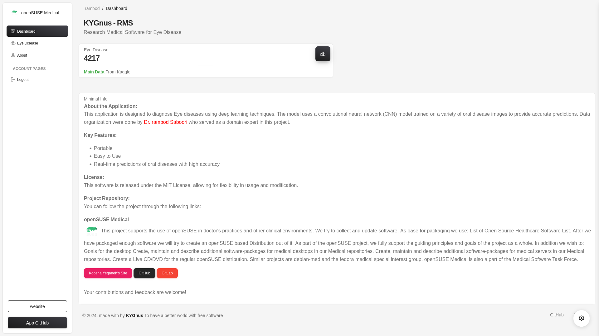

# rms-EYE

This web application uses a convolutional neural network (CNN) model for detecting eye diseases such as cataract, diabetic retinopathy, glaucoma, and normal cases from uploaded eye images. The application leverages the power of deep learning and Flask for deployment as a web-based service. The CNN model is implemented using PyTorch and trained on relevant image data.




## Features

- **User Authentication**: Login system using Flask-Login to access the dashboard.
- **Image Upload**: Users can upload eye images (such as fundus or OCT images).
- **Disease Prediction**: The model predicts the type of eye disease or classifies the image as normal.
- **Responsive Web Interface**: The app provides a simple interface for users to interact with the model.
- **Model Deployment**: The trained CNN model is deployed using Flask, capable of processing and classifying images.

## Technologies Used

- **Flask**: Web framework for building the application.
- **PyTorch**: Deep learning framework for model building and inference.
- **Scikit-learn**: For preprocessing, scaling, and encoding data.
- **OpenCV/Matplotlib**: For image processing and visualization.
- **Flask-Login**: For managing user sessions and authentication.

## Installation

### 1. Clone the repository

```bash
git clone https://github.com/kooshayeganeh/eye-disease-detection.git
cd eye-disease-detection
```

### 2. setup Environment


```bash
python3 -m venv venv
source venv/bin/activate
pip install -r requirements.txt
```


### 3. Test Running

```bash
python app.py
```


## Create App Image

### Linux


```bash
pyinstaller app.py --onefile --add-data "templates:templates" --add-data "static:static" -n rms-eye.exe --hidden-import=sklearn.ensemble._forest --hidden-import=sklearn.tree._tree --hidden-import=joblib --hidden-import=sklearn.impute
```

### Mswindows

```bash
pyinstaller app.py --onefile --add-data "templates;templates" --add-data "static;static" --icon=icon.ico -n rms-eye.exe --hidden-import=sklearn.ensemble._forest --hidden-import=sklearn.tree._tree --hidden-import=joblib --hidden-import=sklearn.impute
```


## Data structure

```
EYE-Disease
├── cataract
├── diabetic_retinopathy
├── glaucoma
└── normal
```


## Resources


https://www.kaggle.com/datasets/gunavenkatdoddi/eye-diseases-classification


